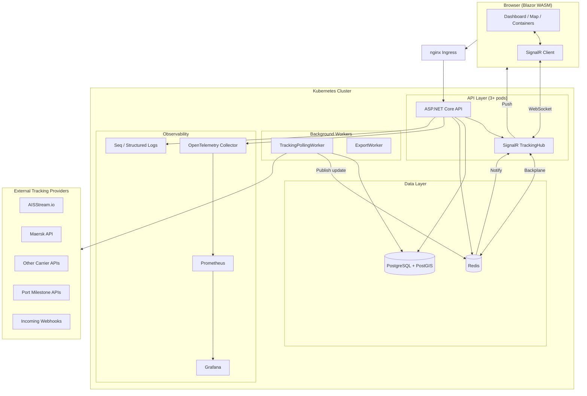

# Container Tracking SaaS — Complete Architecture Blueprint

## 1. Executive Summary

ContainerTrack is a **multi-tenant SaaS platform** for tracking maritime containers and shipments in near-real time. Each Organization receives fully isolated cargo data, users, dashboards, alerts, and exports, governed by a tier-based subscription model.

### Real-Time Tracking Strategy

Container tracking is fundamentally **event-driven milestone tracking**, not continuous GPS. No single data source gives live container location at all times. The platform uses a **mixed-source strategy**:

| Source | What it provides | Latency | Notes |
|--------|-----------------|---------|-------|
| **Carrier APIs** (Maersk, MSC, etc.) | Container milestones, BOL events | Minutes–hours | Commercial API key required per carrier |
| **AIS (aisstream.io)** | Vessel GPS position | Seconds–minutes | Tracks vessels, not individual containers |
| **Port milestone APIs** | Port calls, berth assignments | Hours | Public/semi-public data |
| **Manual updates** | Any event | Immediate | Entered by logistics team |
| **CSV/Excel import** | Bulk historical events | Batch | Self-service via UI |
| **Webhooks** | Push from 3PLs, ERPs | Real-time | Org configures endpoint |
| **Scheduled polling** | Refresh from any provider | Per-tier interval | Background worker |

> **Key limitation:** Container tracking by container number or BOL usually gives event milestones, not GPS. GPS comes from AIS (vessel-level). After a container is discharged, it cannot be tracked by AIS.

---

## 2. Technology Stack

| Component | Choice | Justification |
|-----------|--------|---------------|
| **Backend API** | ASP.NET Core 8 Web API | Mature, high-performance, strong async story, SignalR built-in |
| **Real-time** | SignalR (WebSocket + SSE + long-poll fallback) | Native .NET, automatic fallback, org-scoped groups |
| **Frontend** | Blazor WebAssembly | Single .NET stack, C# shared models, rich WASM interop |
| **Database** | PostgreSQL 16 + PostGIS | JSONB for flexible data, PostGIS for geo queries, proven SaaS choice |
| **Cache / SignalR backplane** | Redis 7 | Pub/sub for SignalR scaling, distributed cache, rate-limit counters |
| **Background jobs** | .NET Hosted Services (BackgroundService) | Zero dependency polling; add Hangfire for persistent job queue |
| **Maps** | OpenStreetMap + Leaflet.js | No API key, maritime-friendly with OpenSeaMap overlay |
| **Authentication** | ASP.NET Core Identity + JWT | Self-contained, refresh token support, org claims in JWT |
| **Authorization** | RBAC + org-scoped policies | Roles enforced at controller and EF level |
| **Deployment** | Docker + Kubernetes | HPA for API, Redis backplane for SignalR horizontal scaling |
| **Observability** | Serilog + OpenTelemetry + Prometheus + Grafana + Seq | Full stack: structured logs, traces, metrics |
| **Export** | ClosedXML (Excel), iText7 (PDF), CsvHelper (CSV) | All formats, no Office required |

---

## 3. System Architecture



---

## 4. Multi-Tenant Organization Model

### Tenant Isolation

- Every data entity (Container, Shipment, TrackingEvent, Alert, etc.) carries `OrganizationId`
- EF Core global query filters enforce org scoping at the ORM level
- JWT claims include `org_id`; the `TenantResolutionMiddleware` validates and resolves it
- **Row-level security** is implemented in EF query filters; PostgREST / direct DB access bypasses this, so no direct DB access is exposed
- Platform Admins impersonate orgs via `X-Organization-Id` header (validated server-side)

### Data Access by Role

| Role | Scope |
|------|-------|
| PlatformAdmin | All organizations — full CRUD on everything |
| OrganizationAdmin | Own org only — manage users, cargo, widgets, alerts, exports, API keys, provider credentials |
| LogisticsManager | Own org — create/update shipments, containers, alerts; read dashboards |
| Viewer | Own org — read-only dashboards, containers, shipments |
| ApiClient | Own org — scoped by API key scopes (read-only, or specific endpoints) |

---

## 5. Tracking Provider Architecture

```
ITrackingProvider
├── IAisProvider          → AisStreamProvider (aisstream.io WebSocket/REST)
├── ICarrierTrackingProvider
│   ├── MaerskCarrierProvider
│   ├── MscCarrierProvider          [stub — wire up similarly]
│   ├── CmaCgmCarrierProvider       [stub]
│   └── GenericCarrierProvider      [config-driven]
├── IPortMilestoneProvider → PortCallProvider
├── IManualTrackingProvider
└── ITrackingNormalizer   → TrackingNormalizer (converts all raw data to NormalizedTrackingEvent)
```

**Event flow:**
```
Provider API → HTTP Response (raw JSON) → TrackingNormalizer → NormalizedTrackingEvent
    → Store as TrackingEvent in PostgreSQL
    → Update Container.Status, Container.CurrentPosition
    → Publish ContainerUpdateMessage to Redis pub/sub
    → SignalR Hub broadcasts to org-{orgId} group
    → Browser updates live
```

---

## 6. Tier System

| Feature | Free | Starter | Business | Enterprise |
|---------|------|---------|---------|-----------|
| Max Containers | 5 | 25 | 100 | 999 |
| Max Users | 2 | 5 | 15 | 100 |
| Poll Interval | 6h | 1h | 15min | 5min |
| History Retention | 7 days | 30 days | 90 days | 1 year |
| WebSocket Live | ❌ | ✅ | ✅ | ✅ |
| API Access | ❌ | ✅ (500/hr) | ✅ (2000/hr) | ✅ (10000/hr) |
| CSV Import | ❌ | ✅ | ✅ | ✅ |
| CSV/Excel Export | ❌ | ✅ | ✅ | ✅ |
| PDF Export | ❌ | ❌ | ✅ | ✅ |
| Webhook Alerts | ❌ | ❌ | ✅ | ✅ |
| Custom Widgets | ❌ | ❌ | ✅ | ✅ |
| Public Tracking Links | ❌ | ✅ | ✅ | ✅ |
| White-label | ❌ | ❌ | ❌ | ✅ |
| SLA | Community | Email | Priority | Dedicated |
| Price/month | Free | $29 | $99 | $399 |

---

## 7. API Endpoints Summary

### Authentication
```
POST /api/v1/auth/register        — Register user + organization (creates Free tier)
POST /api/v1/auth/login           — Login, get JWT + refresh token
POST /api/v1/auth/refresh         — Refresh access token
POST /api/v1/auth/logout          — Invalidate session
```

### Organizations
```
GET  /api/v1/organizations                          — [PlatformAdmin] List all orgs
GET  /api/v1/organizations/mine                     — Get own org
PUT  /api/v1/organizations/mine                     — Update org settings
GET  /api/v1/organizations/mine/users               — List org members
PUT  /api/v1/organizations/mine/users/{id}/role     — Change user role
DELETE /api/v1/organizations/mine/users/{id}        — Remove member
GET  /api/v1/organizations/mine/tier                — Tier limits + usage
```

### Containers
```
GET    /api/v1/containers                  — List (paginated, filterable)
POST   /api/v1/containers                  — Add container [LogisticsManager+]
GET    /api/v1/containers/{id}             — Container detail
PATCH  /api/v1/containers/{id}             — Update container
DELETE /api/v1/containers/{id}             — Soft delete
GET    /api/v1/containers/{id}/events      — Tracking event history
GET    /track/{token}                      — Public tracking link (no auth)
```

### Shipments
```
GET    /api/v1/shipments           — List shipments
POST   /api/v1/shipments           — Create shipment
GET    /api/v1/shipments/{id}      — Shipment detail with containers
PUT    /api/v1/shipments/{id}      — Update shipment
DELETE /api/v1/shipments/{id}      — Soft delete
POST   /api/v1/shipments/{id}/import-csv — CSV container import [Starter+]
```

### Dashboard
```
GET /api/v1/dashboard/layouts          — List dashboard layouts
POST /api/v1/dashboard/layouts         — Create layout
GET  /api/v1/dashboard/layouts/{id}    — Layout detail
PUT  /api/v1/dashboard/layouts/{id}/widgets — Update widget config
GET  /api/v1/dashboard/summary         — KPI summary
GET  /api/v1/dashboard/containers-by-status — Status distribution
GET  /api/v1/dashboard/map-data        — Container + vessel positions
```

### Alerts & Notifications
```
GET    /api/v1/alerts              — List alerts
POST   /api/v1/alerts              — Create alert [LogisticsManager+]
GET    /api/v1/alerts/{id}         — Alert detail
DELETE /api/v1/alerts/{id}         — Remove alert
GET    /api/v1/alerts/notifications — Unread notifications
POST   /api/v1/alerts/notifications/{id}/read — Mark read
```

### Exports
```
POST /api/v1/exports               — Queue export job [export tier]
GET  /api/v1/exports/{id}          — Export status
GET  /api/v1/exports               — Export history
GET  /api/v1/exports/{id}/download?token=X — Secure download
```

### API Keys
```
GET    /api/v1/api-keys            — List API keys [OrgAdmin+]
POST   /api/v1/api-keys            — Create API key [OrgAdmin+]
DELETE /api/v1/api-keys/{id}       — Revoke API key
```

---

## 8. SignalR Hub Groups

```csharp
// Client joins on connect (org-scoped by JWT claim)
org-{orgId}           — all members of an organization
container-{id}        — per-container subscription
shipment-{id}         — per-shipment subscription
platform-admin        — platform admins only

// Messages broadcast by server
ContainerUpdate       → ContainerUpdateMessage
AlertNotification     → AlertNotificationMessage
VesselPosition        → VesselPositionMessage
DashboardRefresh      → DashboardRefreshMessage
```

**Horizontal scaling:** Redis backplane (`AddStackExchangeRedis`) distributes SignalR messages across all API pods. A client connected to Pod A receives messages published by Pod B.

---

## 9. Security Design

| Concern | Implementation |
|---------|---------------|
| Authentication | JWT (HS256, 8h expiry) + refresh tokens |
| Password storage | ASP.NET Identity (PBKDF2) |
| API key storage | PBKDF2-SHA256 hash — raw key never stored |
| Org isolation | JWT `org_id` claim + EF query filters |
| RBAC | AspNetCore policy-based auth |
| Provider credentials | AES-256 encrypted at rest in DB |
| Rate limiting | Per-tier ASP.NET rate limiter + nginx ingress |
| Input validation | Model validation + `[ApiController]` validation pipeline |
| File upload | Content-type + extension check + size limit (5MB) |
| Export downloads | Signed time-limited token (24h), download count cap |
| HTTPS | TLS at ingress (cert-manager + Let's Encrypt) |
| Audit logs | All mutating operations logged with user, IP, method, path |
| CORS | Explicit allowlist of frontend origin(s) |
| Webhook signatures | HMAC-SHA256 `X-CT-Signature` header |

---

## 10. Development Roadmap

### Phase 1: MVP (Weeks 1–6)
- [x] Multi-tenant org + user registration/login
- [x] Container CRUD, manual tracking events
- [x] Shipment grouping
- [x] Basic dashboard (KPI cards, status list)
- [x] In-app notifications
- [x] CSV export
- [x] Free + Starter tier enforcement
- [ ] DB migrations (EF Core Migrations or Flyway)
- [ ] Unit tests for tier enforcement, auth, normalization
- [ ] CI/CD pipeline

### Phase 2: Beta SaaS (Weeks 7–12)
- [ ] AIS vessel tracking (aisstream.io integration)
- [ ] Maersk API integration (carrier tracking)
- [ ] Configurable dashboard widgets (drag/drop)
- [ ] Live map (Leaflet + OpenStreetMap + OpenSeaMap)
- [ ] SignalR real-time updates
- [ ] Alert engine (delay detection, status change triggers)
- [ ] Email alert delivery (SendGrid/SES)
- [ ] CSV import
- [ ] Excel export
- [ ] Payment integration (Stripe)
- [ ] Billing portal

### Phase 3: Production SaaS (Weeks 13–20)
- [ ] Business tier: PDF export, webhook alerts, advanced analytics
- [ ] Customer-facing public tracking links
- [ ] API key management
- [ ] ETA prediction (rule-based: average transit times by lane)
- [ ] Delay detection automation
- [ ] Additional carrier adapters (MSC, CMA CGM, Hapag-Lloyd)
- [ ] Port milestone provider integration (MarineTraffic, Portcast, etc.)
- [ ] Webhook ingestion (3PL push)
- [ ] Rate limiting enforcement
- [ ] Kubernetes deployment + HPA
- [ ] Grafana dashboards + Prometheus alerts
- [ ] GDPR data export/deletion

### Phase 4: Enterprise (Weeks 21+)
- [ ] White-label: custom domain, logo, colors
- [ ] SSO (SAML / OIDC)
- [ ] Enterprise tier custom limits
- [ ] Dedicated SignalR cluster
- [ ] Global CDN for map tiles
- [ ] ETA ML model (historical transit data)
- [ ] API for customer integrations (OpenAPI v3 SDK)
- [ ] Audit log export for compliance
- [ ] Data retention policy per org
- [ ] Multi-region deployment option
- [ ] SLA monitoring and reporting

---

## 11. Important Limitations

1. **Container numbers ≠ GPS.** Container and BOL tracking via carrier APIs provides _event milestones_ (gate-in, loaded, departed, arrived). GPS location is inferred from vessel AIS only while the container is aboard.

2. **AIS tracks vessels, not containers.** After a container is discharged at the destination port, vessel AIS provides no further location data for that container.

3. **Carrier APIs require commercial agreements.** Maersk, MSC, CMA CGM, and others require developer portal registration or commercial contracts. Pricing and availability vary.

4. **Open AIS data has latency.** aisstream.io and similar services relay AIS with varying delays (seconds to minutes). They do not provide historical AIS tracks on free tiers.

5. **Port APIs vary in quality.** Port community systems differ by country and port. Some are public, some require commercial access, some have no API.

6. **The system is provider-agnostic by design.** The `ITrackingProvider` abstraction allows any combination of free, open-source, and paid sources to be plugged in without changing the core platform.

7. **Polling interval determines freshness.** The tier-based poll interval (Free: 6h, Enterprise: 5min) determines how current milestone data is. True live GPS requires WebSocket subscription to AIS for the relevant vessel.
